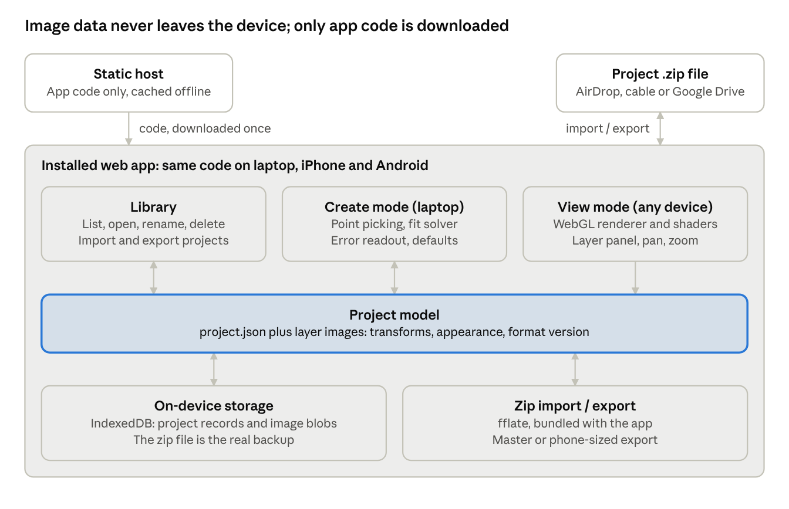

# Map Layers App Architecture

Exported from the planning doc on 8 Oct 2026. Later decisions are in `CLAUDE.md` at the repo root and take precedence.

## Overview

One installable web app (PWA) that aligns separate map layer images to a base layer on a laptop, then views them on iPhone and Android with per-layer opacity and color controls. Everything runs and is stored on the device; only the app's code is hosted.

- **Create mode (laptop):** import layers, align each to the base layer with control points, set default appearance, export a project file.
- **View mode (any device):** open a project from the library, adjust opacity and color per layer, pan and zoom.
- **Sharing:** a single `.zip` project file moved by AirDrop, cable or Google Drive. Friends import it into their own copy of the app.
- **Out of scope for now:** real-world basemap alignment, syncing between devices, hosted share links, drawing or erasing inside layers.

Guiding principle: no image or project data ever leaves the device through the app. Airplane mode must not break anything after install.

## System components



The three screens share one project model; storage and the zip file are two ways of holding the same data. View mode only reads the model, so a view-only build could drop Create mode without other changes.

Stack: plain TypeScript with Vite, no UI framework beyond what is needed; WebGL for rendering; fflate for zip; a service worker for offline. Small dependencies keep the app fast to load on phones and easy to audit for network calls.

## Data model and project file

A project is one zip: original layer images plus one JSON file that holds everything else. The same structure is used in on-device storage and in the exported file, so import and export are a straight copy.

```
harbour-map.zip
  project.json
  thumbnail.png
  layers/          originals, unchanged (PNG or JPEG)
  layers-phone/    optional downscaled copies, max ~4000 px per side
```

`project.json` fields:

| Field | Contents |
| --- | --- |
| `formatVersion` | Integer, starts at 1. The importer upgrades older versions. |
| `id`, `name`, `created`, `modified` | Identity and dates. |
| `viewOnly` | Hides Create mode on import. A convenience, not protection. |
| `baseLayerId` | The layer every other layer is aligned to. |
| `layers[]` | Per layer: `id`, `name`, `file`, `phoneFile`, pixel `width`/`height`, `order`, `visible`. |
| `layers[].alignment` | `mode` (similarity or affine), `points[]` of {layer x,y; base x,y}, and the solved 2×3 `transform`. |
| `layers[].appearance` | Defaults: `opacity`, `brightness`, `contrast`, `saturation`, `hue`, `recolor` (hex or none). |

The solved transform is stored as well as the points so the viewer never needs the fitting code. Points are kept so alignment can be edited later.

The base layer has an identity transform. Layer pixel sizes are recorded so the app can detect an image that was replaced with a different size and warn that its points no longer match.

## Create mode

Create mode turns a set of differently sized images into one aligned project. It is designed for a laptop with a mouse; it works on a tablet but is not tuned for phones.

1. **Start a project** and import images (PNG, JPEG; PDF converted to PNG on import at a chosen resolution).
2. **Pick the base layer.** It sets the coordinate space for everything else.
3. **Align each other layer** in a side-by-side view: click a feature on the layer, then the same feature on the base. A magnifier loupe shows pixels under the cursor.
4. **Check the fit.** After 2 points the layer snaps into place. From 3 points on, each point shows its error in base-layer pixels, and the total RMS error is shown. Outliers are highlighted.
5. **Fine-tune in overlay view.** The layer is drawn over the base at partial opacity; points can be dragged and the fit updates live.
6. **Set default appearance** per layer (see View mode) and the layer order.
7. **Save** to the on-device library and **export** the zip.

Fitting rules:

- Default mode is **similarity** (shift, rotate, uniform scale), solved by least squares from 2 or more points.
- **Affine** (adds separate x/y scale and skew) is a per-layer toggle, enabled from 3 points and recommended only from 4, so stretch can be told apart from click error.
- Both are small closed-form least-squares solves; no external maths library is needed.
- The app shows the RMS error for both modes side by side, so it is clear whether affine actually helps.

## View mode

View mode draws all layers with WebGL in one canvas: each layer is a textured quad placed by its transform, and a small shader applies its appearance settings. That keeps sliders smooth on phones with large images.

| Control | How it works | Cost |
| --- | --- | --- |
| Show / hide | Skip the layer when drawing | Trivial |
| Opacity | Alpha in the shader | Trivial |
| Brightness, contrast, saturation | Per-pixel maths in the shader | Low |
| Hue shift | Rotate color in the shader | Low |
| Recolor to one color | Keep alpha, replace RGB with the chosen color | Low |
| Per-color opacity (later) | Mask pixels near a picked color, with a tolerance | Medium |
| Pan, pinch-zoom | One camera transform applied to all layers | Low |

The creator's appearance settings are the starting point. Changes a viewer makes are kept per device for that project, with a "Reset to defaults" button. They are never written into the project file unless the creator saves in Create mode.

The layer panel is a bottom sheet on phones and a side panel on laptops. Each row holds visibility, opacity slider and a button that expands the color controls.

## Storage, export and sharing

The on-device library lives in the browser's IndexedDB: one record per project (the parsed `project.json`) plus image blobs. The exported zip is the backup, not IndexedDB.

- **Library screen:** thumbnail, name and date per project; open, rename, delete, export.
- **Persistence:** the app calls `navigator.storage.persist()` on first save. iPhone can still clear data for an unused web app, so the library shows a reminder to keep the zip somewhere safe.
- **Export:** "Master" keeps full-resolution originals for re-editing; "Phone" adds or substitutes downscaled layers to keep size and memory down.
- **Import:** pick a `.zip` from the file picker. The importer checks `formatVersion`, validates the JSON, and adds the project to the library; a project with the same `id` asks whether to replace it.
- **Sharing:** put the zip on Google Drive and send the link. Friends open the app, then download and import the file. Updates mean re-uploading and re-importing.
- **Zip handling:** a small library (fflate or JSZip) bundled with the app, so nothing loads from third-party servers at runtime.

**Hosting:** Cloudflare Pages, free plan, served at `maps.opicartes.com`. The domain is already registered and managed in Cloudflare, so adding the subdomain in the Pages project creates the DNS record and HTTPS certificate automatically.

- Deploy in the same Cloudflare account that holds `opicartes.com`.
- Add only the `maps` subdomain. Leave the root domain and its email records (MX, SPF, DKIM, DMARC) untouched.
- Check the DNS list first that `maps` isn't already used by the other app.
- A service worker caches the app's files for offline use. No analytics or third-party scripts.

The app gets its own origin, so its on-device storage is separate from anything the other app on `opicartes.com` stores.

## Phone constraints

Memory, not processing speed, is the limit on phones. The design keeps one project loaded at a time and caps image size.

| Constraint | Effect | Mitigation |
| --- | --- | --- |
| iPhone canvas/texture limits (about 16 million pixels, roughly 4000 × 4000) | Large layers fail to draw or crash the tab | "Phone" export downscales; the viewer checks `MAX_TEXTURE_SIZE` and downscales on import if needed |
| Total memory per tab | Many large layers crash on older phones | Load only the open project; release textures when leaving it |
| Storage cleanup on iPhone | Library can disappear | Zip backup on Drive; persistence request |
| Small touch targets | Hard to use sliders and pick points | Large controls in View; Create designed for laptop |
| iPhone install flow | No install prompt; manual "Add to Home Screen" | One-time instruction screen on first visit in Safari |

Very large originals (over about 10,000 px per side) would need tiling to view at full detail on phones. That is not in the plan; downscaling covers the expected use.

## Roadmap

Each phase ends with something usable, so the plan can stop or change direction at any point.

1. **Core alignment (laptop only).** Import images, pick base, 2+ point similarity fit with error readout, overlay view, WebGL renderer with opacity sliders. Nothing is saved yet. Purpose: prove the alignment workflow on real layers.
2. **Projects and files.** IndexedDB library, `project.json` format with `formatVersion`, zip export and import, affine toggle.
3. **Phone viewing.** Installable PWA with offline cache, View mode UI for touch, phone export with downscaling, iPhone install instructions. Test on one iPhone and one Android.
4. **Appearance controls.** Shader controls for brightness, contrast, saturation, hue and recolor; per-device viewer settings with reset.
5. **Later, if needed.** PDF import, blend modes, view-only flag, per-color opacity, real-world basemap alignment, hosted share links.

## Open questions and risks

- [ ] Typical size of the layer images (pixels per side, file size). Over about 10,000 px changes the phone plan.
- [ ] Are any source layers vector PDFs with internal layers or GeoPDF coordinates? That could replace manual splitting or alignment.
- [ ] Do any layers have solid white backgrounds instead of transparency? If so, a multiply blend mode may be needed after all.
- [ ] Are the maps distorted (hand-drawn, old scans)? Affine may not be enough; a rubber-sheet transform is a large addition.
- [ ] How many layers per map, and how many maps on a phone? This sets storage and memory budgets.
- [ ] Subdomain name: `maps.opicartes.com` is the working choice; confirm or rename.

Main risk: iPhone behaviour for installed web apps (storage cleanup, memory limits) varies by iOS version. Phase 3 should be tested on the oldest iPhone that will use it before building further.
